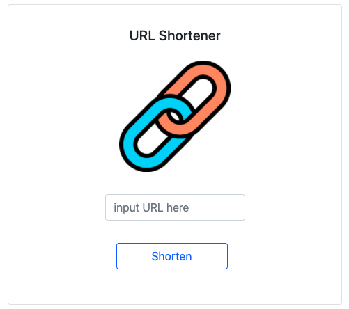

# 短網址產生器


## Description

This is a website created by node.js Express. 
- 首頁畫面上有一個表單，使用者可以在表單輸入原始網址，如 https://www.google.com；送出表單之後，畫面會回傳格式化後的短網址，如 https://shortURL.com/6y7UP
- 在伺服器啟動期間，使用者可以在瀏覽器的網址列，輸入你提供的短網址（如 https://shortURL.com/6y7UP），瀏覽器就會導向原本的網站（如 https://www.google.com）
- 短網址輸出格式為 5 碼英數組合
- 使用者可以按 Copy 來複製縮短後的網址

### Executing program

1. Open terminal and git clone
```
git clone https://github.com/wenrou77/short_url.git
```

2. Initialization
```
npm install 
```

3. Execute
- To run on the index page
```
npm run dev
```

## Authors

Wendy (wendy@gmail.com)
